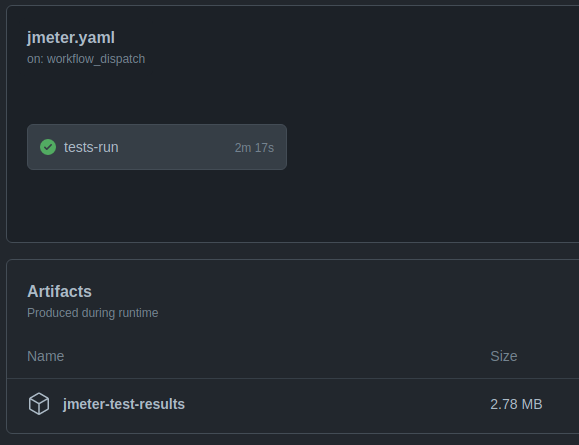

# Java Monorepo

[](https://github.com/claudiney-silva/java-monorepo/actions/workflows/build.yaml)

## Git Hub Actions

<details><summary>Deploy CI/CD via Git Hub Actions</summary>

Exemplo de **Monorepo** com **Maven/Springboot** e deploy em **K8S** com **Helm Chart** utilizando **Github Actions**.
</details>

### Git flow

<details><summary>Fluxo Git Flow</summary>


</details>

---

## Cluster Kubernetes Local

Passo a passo para configuração localmente:

### Instalação / Configuração do Ambiente

#### Docker

<details><summary>Docker install</summary>

Após a instalação é necessário reiniciar a sessão para que as permissões sejam atribuídas

```
sudo curl -L https://get.docker.com/ | bash
sudo usermod -aG docker $USER
```

</details>

#### Kubectl

<details><summary>Kubectl install</summary>

```
curl -LO https://storage.googleapis.com/kubernetes-release/release/`curl -s https://storage.googleapis.com/kubernetes-release/release/stable.txt`/bin/linux/amd64/kubectl
chmod +x kubectl && sudo mv kubectl /usr/local/bin/
```
</details>

#### Helm

<details><summary>Helm install</summary>

```
wget https://get.helm.sh/helm-v3.8.2-linux-amd64.tar.gz
tar xvf helm-v3.8.2-linux-amd64.tar.gz
sudo mv linux-amd64/helm /usr/local/bin
rm helm-v3.8.2-linux-amd64.tar.gz
rm -rf linux-amd64
helm version
```
</details>

#### Kind

<details><summary>Kind install and custer creation</summary>

```
curl -Lo ./kind https://kind.sigs.k8s.io/dl/v0.12.0/kind-linux-amd64
chmod +x ./kind
sudo mv ./kind /usr/local/bin
kind create cluster
```
</details>

#### HPA

<details><summary>Horizontal Pod Autoscaler</summary>

Para habilitar o HPA no cluster é preciso habilitar o **metrics-server**.

Para acessar o repositório oficial [clique aqui](https://github.com/kubernetes-sigs/metrics-server).

Porém para que ele funcione corretamente é preciso habilitar o uso de certificados auto-assinados no deployment. 

Esse configuração foi feita adicionando as linhas abaixo no deployment original:

```
command:
- /metrics-server
- --kubelet-insecure-tls        
```

Para instalar o **metrics-server** com os certificados auto-assinados execute o comando abaixo:

```
kubectl apply -f ./k8s/metrics-server-kubelet-insecure-tls.yaml
```
</details>

#### Istio (Service Mesh)

Passos para instalação do Istio e visualização dos serviços via Kiali.

<details><summary>Istio install, configure Kind Cluster and Add-ons (Kiali, Prometheus, Grafana, etc)</summary>

##### Download
```
curl -L https://istio.io/downloadIstio | sh -
cd istio-1.13.3
export PATH=$PWD/bin:$PATH
```

##### Install on Kind cluster
```
kubectl create namespace istio-system
helm install istio-base manifests/charts/base -n istio-system
helm install istiod manifests/charts/istio-control/istio-discovery -n istio-system
helm install istio-ingress manifests/charts/gateways/istio-ingress -n istio-system
helm install istio-egress manifests/charts/gateways/istio-egress -n istio-system
kubectl get pods -n istio-system
```

##### Kiali, Prometheus, Grafana, etc install
```
kubectl apply -f samples/addons
kubectl get svc -n istio-system
kubectl port-forward svc/kiali -n istio-system 20001
```

Para acessar a interface do Kiali [clique aqui](http://localhost:20001).

</details>


#### Java-Monorepo

<details><summary>Java-Monorepo install no Kind cluster com Istio injetando envoy</summary>

O Helm do monorepo deve ser instalado após a instalação do **Istio** para que o proxy **envoy** seja injetado nos PODs.
```
kubectl create namespace java-monorepo
kubectl label namespace java-monorepo istio-injection=enabled
helm install java-monorepo ./k8s/charts/java-monorepo -n java-monorepo
kubectl get pods -n java-monorepo
kubectl port-forward svc/app-bar -n java-monorepo 8080:80
```

Para acessar o app-bar [clique aqui](http://localhost:8080/app-bar/track).

</details>

---

## Teste de carga

### JMeter

<details><summary>Você pode executar os testes via Git Actions e fazer o download dos resultados ou também pode executá-los localmente.</summary>

## Git Actions



## Localmente and Plan Test

Faça o [download](https://jmeter.apache.org/download_jmeter.cgi) do JMeter e crie um plano de testes pela ferramenta visual.

Na pasta `/bin` do JMeter execute o comando:

```
./jmeter.sh -n -t "/PATH-PROJETO/java-monorepo/apps/bar/src/main/resources/simple.jmx" -l "/PATH-PROJETO/java-monorepo/apps/bar/target/jmeter/results.csv" -e -o "/PATH-PROJETO/java-monorepo/apps/bar/target/jmeter/output"
```
</details>

### Bash

<details><summary>Exemplo de teste de carga via bash</summary>

```
while true; do wget -q -O- http://localhost:8080/app-bar;done;
```

</details>
